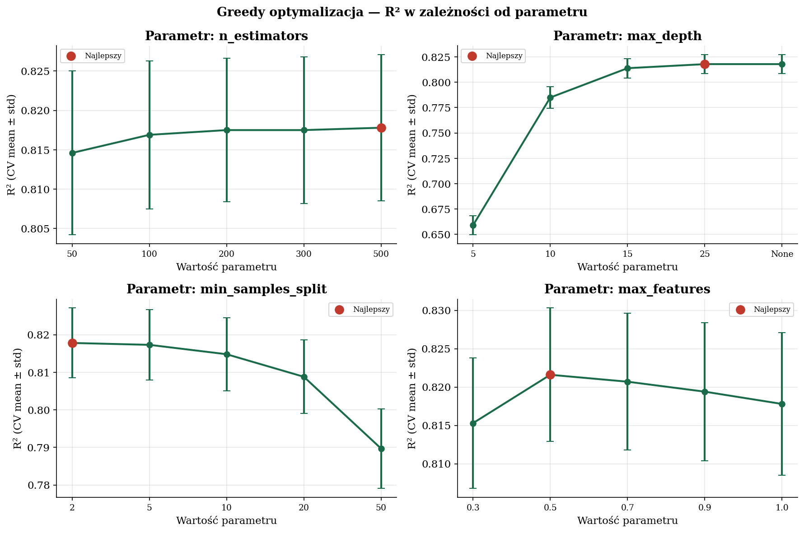
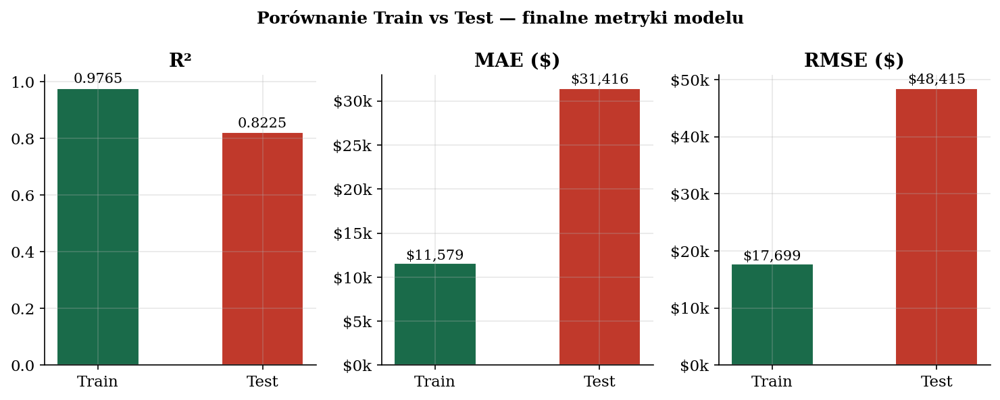
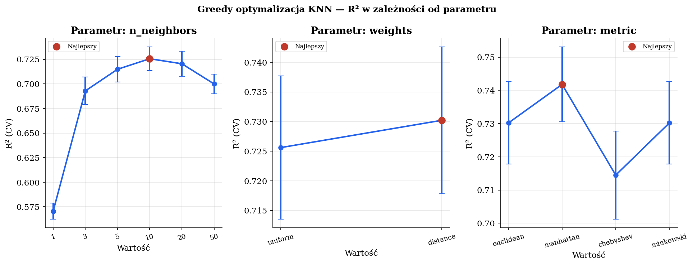
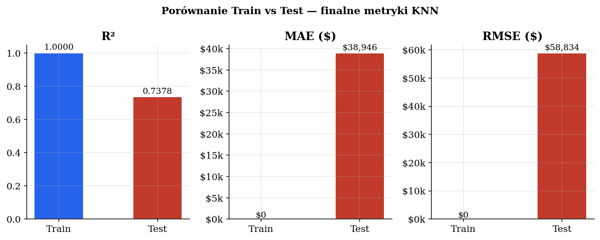

# Projekt Elementy sztucznej inteligencji

## Wstęp i opis badanych problemów

W niniejszym projekcie porównano skuteczność wybranych metod uczenia maszynowego w zadaniu regresji. Do analizy wykorzystano zbiór danych California Housing, który jest często używany do testowania modeli predykcyjnych. Celem projektu było sprawdzenie, jak zmiany wybranych hiperparametrów wpływają na jakość działania modeli oraz ich zdolność do przewidywania wartości na nowych danych. Chodziło więc nie tylko o uzyskanie jak najlepszego wyniku, ale też o lepsze zrozumienie, jak zachowują się różnee metody przy zmianie ustawień.

W projekcie porównano kilka metod:

- sztuczne sieci neuronowe (MLP),
- lasy losowe (Random Forest),
- algorytm k najbliższych sąsiadów (k-NN),
- Gradient Boosting,
- SVM.

Wszystkie te metody wykorzystano do rozwiązania problemu regresji, czyli przewidywania wartości zmiennej median_house_value. Zadanie polegało na estymacji mediany cen nieruchomości na podstawie dostępnych cech opisujących dany obszar. Nie jest to łatwy problem, bo ceny nieruchomości zależą od wielu różnych czynników, a zależności między nimi często są nieliniowe.

Do oceny jakości modeli wykorzystano miary MAE,RMSE oraz R². Dzięki nim można było sprawdzić, jak duży jest błąd przewidywań i jak dobrze model dopasowuje się do danych. 

### 1.1. Czym jest Random Forest 

Random Forest, czyli las losowy, to algorytm uczenia maszynowego oparty na wielu drzewach decyzyjnych. Zamiast polegać na jednym drzewie, tworzy cały „las” drzew, z których każde uczy się na trochę innym, losowo wybranym fragmencie danych i zwykle korzysta tylko z części dostępnych cech. Działanie polega na tym, że każde drzewo podejmuje własną decyzję, a następnie wyniki wszystkich drzew są łączone. W klasyfikacji wybierana jest najczęściej wskazywana klasa, a w regresji zwykle obliczana jest średnia z przewidywań drzew. Dzięki temu model jest stabilniejszy i mniej podatny na błędy pojedynczego drzewa. Najważniejsza idea Random Forest polega na połączeniu wielu prostszych modeli oraz wprowadzeniu losowości, co zmniejsza ryzyko przeuczenia i poprawia jakość przewidywań

## 1.2. Strojenie hiperparametrów modelu Random Forest

Strojenie modelu Random Forest wykonano metodą greedy. Oznacza to, że hiperparametry były dobierane kolejno, jeden po drugim. W każdym kroku zmieniano tylko jeden parametr, a pozostałe miały aktualnie najlepsze znalezione wartości. Dzięki temu można było sprawdzić, jak konkretna zmiana wpływa na jakość modelu.

Do oceny jakości modelu wykorzystano 5-krotną walidację krzyżową na zbiorze treningowym. Zbiór testowy nie był używany podczas strojenia, ponieważ został zostawiony do końcowej oceny modelu.

Wyniki oceniano za pomocą trzech metryk:

- **R²** – pokazuje, jak dobrze model wyjaśnia zmienność danych,
- **MAE** – średni błąd bezwzględny,
- **RMSE** – pierwiastek z błędu średniokwadratowego.

Najważniejszą metryką przy wyborze najlepszych parametrów było **R²**. Im wyższa wartość R², tym lepiej model dopasowuje się do danych.

---

### 1.2.1. Strojenie parametru `n_estimators`

Na początku sprawdzono wpływ liczby drzew w lesie. Parametr `n_estimators` określa, ile drzew decyzyjnych zostanie utworzonych w modelu Random Forest. Zwykle większa liczba drzew poprawia stabilność modelu, ale jednocześnie zwiększa czas uczenia.

Testowano wartości od 50 do 500.

| `n_estimators` | R² | Odchylenie R² | MAE | RMSE |
|---|---:|---:|---:|---:|
| 50  | 0.8146 | 0.0104 | 32457 | 49708 |
| 100 | 0.8169 | 0.0094 | 32255 | 49404 |
| 200 | 0.8175 | 0.0091 | 32169 | 49316 |
| 300 | 0.8175 | 0.0093 | 32175 | 49324 |
| 500 | 0.8178 | 0.0093 | 32154 | 49274 |

Najlepszy wynik uzyskano dla `n_estimators = 500`, gdzie R² wyniosło **0.8178**. Widać, że zwiększanie liczby drzew poprawiało wynik, ale różnice między 200, 300 i 500 drzewami były już bardzo małe. Oznacza to, że po pewnym momencie dodawanie kolejnych drzew nie daje już dużego zysku, a jedynie wydłuża czas działania modelu.

---

### 1.2.2. Strojenie parametru `max_depth`

Następnie sprawdzono parametr `max_depth`, czyli maksymalną głębokość drzew. Parametr ten decyduje o tym, jak bardzo szczegółowe mogą być pojedyncze drzewa w lesie. Zbyt mała głębokość może powodować niedouczenie modelu, natomiast zbyt duża może prowadzić do przeuczenia.

| `max_depth` | R² | Odchylenie R² | MAE | RMSE |
|---|---:|---:|---:|---:|
| 5    | 0.6590 | 0.0094 | 48030 | 67423 |
| 10   | 0.7849 | 0.0105 | 36379 | 53543 |
| 15   | 0.8138 | 0.0096 | 32747 | 49809 |
| 25   | 0.8178 | 0.0095 | 32159 | 49276 |
| None | 0.8178 | 0.0093 | 32154 | 49274 |

Najgorszy wynik uzyskano dla `max_depth = 5`, co oznacza, że drzewa były wtedy zbyt płytkie i nie były w stanie dobrze odwzorować zależności w danych. Wraz ze zwiększaniem głębokości wynik modelu wyraźnie się poprawiał.

Najlepszy wynik uzyskano dla `max_depth = None`, czyli bez ograniczenia głębokości drzewa. Wynik był jednak bardzo podobny do `max_depth = 25`, dlatego można stwierdzić, że po osiągnięciu odpowiedniej głębokości dalsze zwiększanie złożoności modelu nie daje już dużej poprawy.

---

### 1.2.3. Strojenie parametru `min_samples_split`

Kolejnym analizowanym parametrem był `min_samples_split`. Określa on minimalną liczbę próbek wymaganą do podziału węzła w drzewie. Im większa wartość tego parametru, tym prostsze stają się drzewa, ponieważ trudniej jest tworzyć kolejne podziały.

| `min_samples_split` | R² | Odchylenie R² | MAE | RMSE |
|---|---:|---:|---:|---:|
| 2  | 0.8178 | 0.0093 | 32154 | 49274 |
| 5  | 0.8173 | 0.0094 | 32224 | 49341 |
| 10 | 0.8148 | 0.0097 | 32561 | 49679 |
| 20 | 0.8088 | 0.0098 | 33328 | 50484 |
| 50 | 0.7897 | 0.0106 | 35530 | 52938 |

Najlepsza okazała się wartość `min_samples_split = 2`. Przy większych wartościach wynik stopniowo się pogarszał. Oznacza to, że w tym przypadku model lepiej działał, gdy drzewa mogły wykonywać bardziej szczegółowe podziały.

Największy spadek jakości widać dla `min_samples_split = 50`, gdzie R² spadło do **0.7897**. Taka wartość zbyt mocno ograniczała model i powodowała, że nie mógł on wystarczająco dobrze dopasować się do danych.

---

### 1.2.4. Strojenie parametru `max_features`

Ostatnim testowanym parametrem był `max_features`. Określa on, jaka część cech jest brana pod uwagę przy szukaniu najlepszego podziału w drzewie. W Random Forest często korzystne jest używanie tylko części cech, ponieważ zwiększa to różnorodność drzew i może poprawić jakość całego modelu.

| `max_features` | R² | Odchylenie R² | MAE | RMSE |
|---|---:|---:|---:|---:|
| 0.3 | 0.8153 | 0.0085 | 33288 | 49612 |
| 0.5 | 0.8216 | 0.0087 | 32127 | 48757 |
| 0.7 | 0.8207 | 0.0089 | 32066 | 48885 |
| 0.9 | 0.8194 | 0.0090 | 32083 | 49060 |
| 1.0 | 0.8178 | 0.0093 | 32154 | 49274 |

Najlepszy wynik, uzyskano dla `max_features = 0.5`, gdzie R² wyniosło **0.8216**. Oznacza to, że model osiągnął najlepsze rezultaty, gdy przy każdym podziale analizował około połowę dostępnych cech.

dla  `max_features = 0.7` wynik był bardzo podobny, a MAE było nawet minimalnie niższe. Jednak ponieważ głównym kryterium wyboru było R², jako najlepszą wartość przyjęto `0.5`.

---

### 1.2.5. Wizualizacja procesu strojenia

Poniższy wykres przedstawia zmianę wartości R² dla kolejnych sprawdzanych parametrów. Czerwonym punktem oznaczono najlepszą wartość w danym kroku optymalizacji.

Na wykresie widać, że największa poprawa wystąpiła przy zmianie parametru `max_depth`. Dla bardzo małej głębokości model osiągał słabe wyniki, a po zwiększeniu głębokości R² szybko wzrosło.

W przypadku `n_estimators` poprawa była bardziej stopniowa. Dodawanie kolejnych drzew lekko poprawiało wynik, ale po przekroczeniu około 200 drzew różnice były już niewielkie.

Dla parametru `min_samples_split` najlepszy wynik był przy najmniejszej wartości, czyli `2`. Zwiększanie tego parametru pogarszało wynik, ponieważ model stawał się mniej szczegółowy.

Najlepszy wynik dla `max_features` uzyskano przy wartości `0.5`. Pokazuje to, że losowe wybieranie tylko części cech przy podziałach było korzystniejsze niż korzystanie ze wszystkich cech.

---

### 1.2.6. Końcowa konfiguracja modelu

Po zakończeniu strojenia jako najlepszy zestaw hiperparametrów wybrano:

| Parametr | Najlepsza wartość |
|---|---:|
| `n_estimators` | 500 |
| `max_depth` | None |
| `min_samples_split` | 2 |
| `max_features` | 0.5 |

Dla tej konfiguracji najlepszy średni wynik w walidacji krzyżowej wyniósł:

| Metryka | Wartość |
|---|---:|
| R² | 0.8216 |
| MAE | 32127 |
| RMSE | 48757 |

Można więc uznać, że strojenie hiperparametrów poprawiło jakość modelu. Początkowo model uzyskiwał R² na poziomie około **0.8146**, a po dobraniu parametrów końcowy wynik walidacji krzyżowej wzrósł do **0.8216**.

Poprawa nie była bardzo duża, ale była zauważalna. Największe znaczenie miały parametry `max_depth` oraz `max_features`. Liczba drzew również wpływała na wynik, ale po pewnym momencie jej zwiększanie dawało już tylko niewielką poprawę.

---

### 1.2.7. Ocena finalnego modelu na zbiorze testowym

Po wybraniu najlepszych parametrów model został ponownie wytrenowany na całym zbiorze treningowym. Następnie oceniono go na zbiorze testowym, który nie był używany podczas strojenia.

| Zbiór | R² | MAE | RMSE |
|---|---:|---:|---:|
| Train | 0.9765 | 11579 | 17699 |
| Test | 0.8225 | 31416 | 48415 |

Model osiągnął bardzo wysoki wynik na zbiorze treningowym, gdzie R² wyniosło **0.9765**. Na zbiorze testowym wynik był niższy i wyniósł **0.8225**. Taka różnica może wskazywać na częściowe przeuczenie modelu, ponieważ model lepiej radzi sobie z danymi, na których był uczony.

Mimo tego wynik testowy nadal można uznać za dobry. Model wyjaśnia około **82% zmienności cen mieszkań** w danych testowych. Średni błąd bezwzględny wyniósł około **31 416 dolarów**, co oznacza, że przeciętna predykcja modelu różniła się od rzeczywistej wartości właśnie o taką kwotę.

RMSE było wyższe od MAE i wyniosło około **48 415 dolarów**, co oznacza, że w danych występowały także większe błędy predykcji.

---

## 2. Model K-Nearest Neighbors (KNN)

### 2.1. Opis KNN

KNN, czyli metoda k najbliższych sąsiadów, to algorytm uczenia maszynowego, który klasyfikuje nowy obiekt na podstawie podobieństwa do wcześniej zapisanych danych.
Działa tak, że szuka k najbliższych obiektów i sprawdza, do jakich klas należą. Następnie wybiera tę klasę, która pojawia się najczęściej wśród sąsiadów.
Najważniejsza idea KNN jest taka, że podobne obiekty znajdują się blisko siebie. Algorytm jest łatwy do zrozumienia, ale przy dużej liczbie danych może działać wolniej.

## 1.3. Strojenie hiperparametrów modelu KNN

Strojenie modelu KNN wykonano metodą greedy, podobnie jak w przypadku modelu Random Forest. Oznacza to, że parametry były dobierane kolejno. W każdym kroku zmieniano jeden parametr, a pozostałe miały aktualnie najlepsze znalezione wartości.

Najważniejszą metryką przy wyborze parametrów było **R²**.

---

### 1.3.1. Strojenie parametru `n_neighbors`

Na początku sprawdzono parametr `n_neighbors`, czyli liczbę najbliższych sąsiadów branych pod uwagę podczas predykcji. Jest to jeden z najważniejszych parametrów w metodzie KNN.

Mała liczba sąsiadów może powodować zbyt duże dopasowanie do pojedynczych obserwacji, natomiast zbyt duża liczba sąsiadów może nadmiernie uśredniać wyniki i osłabiać dokładność predykcji.

Testowano następujące wartości:

| `n_neighbors` | R² | Odchylenie R² | MAE | RMSE |
|---:|---:|---:|---:|---:|
| 1  | 0.5706 | 0.0083 | 49489 | 75663 |
| 3  | 0.6929 | 0.0140 | 42874 | 63973 |
| 5  | 0.7149 | 0.0129 | 41423 | 61638 |
| 10 | 0.7256 | 0.0121 | 40924 | 60470 |
| 20 | 0.7205 | 0.0126 | 41758 | 61036 |
| 50 | 0.7000 | 0.0100 | 43894 | 63235 |

Najlepszy wynik uzyskano dla `n_neighbors = 10`, gdzie R² wyniosło **0.7256**. Widać, że dla `n_neighbors = 1` model działał zdecydowanie słabiej, ponieważ opierał predykcję tylko na jednym najbliższym sąsiedzie. Taki wynik był mało stabilny i dawał największe błędy, czyli MAE = **49 489** oraz RMSE = **75 663**. Wraz ze zwiększaniem liczby sąsiadów jakość modelu poprawiała się aż do wartości `10`. Potem wynik zaczął spadać. Dla `n_neighbors = 50` R² wyniosło już tylko **0.7000**, a błędy ponownie wzrosły. Oznacza to, że zbyt duża liczba sąsiadów powodowała zbyt mocne uśrednianie predykcji.

---

### 1.3.2. Strojenie parametru `weights`

Następnie sprawdzono parametr `weights`, który określa sposób ważenia sąsiadów.

Testowano dwa warianty:

| `weights` | R² | Odchylenie R² | MAE | RMSE |
|---|---:|---:|---:|---:|
| uniform | 0.7256 | 0.0121 | 40924 | 60470 |
| distance | 0.7302 | 0.0124 | 40448 | 59959 |

Lepszy wynik uzyskano dla `weights = distance`. Oznacza to, że model działał lepiej, gdy bliżsi sąsiedzi mieli większy wpływ na końcową predykcję niż dalsi sąsiedzi.

---

### 1.3.3. Strojenie parametru `metric`

Ostatnim sprawdzanym parametrem była metryka odległości, czyli sposób obliczania podobieństwa między obserwacjami.

Testowano cztery metryki:

| `metric` | R² | Odchylenie R² | MAE | RMSE |
|---|---:|---:|---:|---:|
| euclidean | 0.7302 | 0.0124 | 40448 | 59959 |
| manhattan | 0.7418 | 0.0113 | 39677 | 58657 |
| chebyshev | 0.7145 | 0.0133 | 41791 | 61677 |
| minkowski | 0.7302 | 0.0124 | 40448 | 59959 |

Najlepszy wynik uzyskano dla metryki `manhattan`, gdzie R² wyniosło **0.7418**. Był to najlepszy wynik spośród wszystkich testowanych ustawień w walidacji krzyżowej.

Najgorzej wypadła metryka `chebyshev`, dla której R² spadło do **0.7145**. Oznacza to, że ten sposób liczenia odległości gorzej pasował do analizowanych danych.

---

### 1.3.4. Wizualizacja procesu strojenia

Poniższy wykres przedstawia zmianę wartości R² dla kolejnych sprawdzanych parametrów modelu KNN. Czerwonym punktem oznaczono najlepszą wartość dla danego parametru.

Na wykresie widać, że największą różnicę zrobił parametr `n_neighbors`. Dla wartości `1` wynik był słaby, natomiast po zwiększeniu liczby sąsiadów jakość modelu wyraźnie wzrosła.

W przypadku parametru `weights` lepszy wynik uzyskano dla `distance`, czyli wtedy, gdy bliżsi sąsiedzi mieli większy wpływ na predykcję.

Dla metryki odległości najlepsza okazała się `manhattan`. Oznacza to, że sposób liczenia odległości miał zauważalny wpływ na jakość modelu.

---

### 1.3.5. Końcowa konfiguracja modelu

Po zakończeniu strojenia jako najlepszy zestaw hiperparametrów wybrano:

| Parametr | Najlepsza wartość |
|---|---:|
| `n_neighbors` | 10 |
| `weights` | distance |
| `metric` | manhattan |
| `p` | 2 |

Dla tej konfiguracji najlepszy średni wynik w walidacji krzyżowej wyniósł:

| Metryka | Wartość |
|---|---:|
| R² | 0.7418 |
| MAE | 39677 |
| RMSE | 58657 |

Można zauważyć, że strojenie hiperparametrów poprawiło jakość modelu KNN. Największe znaczenie miała liczba sąsiadów oraz wybór metryki odległości.

---

### 1.3.6. Ocena finalnego modelu na zbiorze testowym

Po wybraniu najlepszych parametrów model został wytrenowany na całym zbiorze treningowym, a następnie oceniony na zbiorze testowym.

| Zbiór | R² | MAE | RMSE |
|---|---:|---:|---:|
| Train | 1.0000 | 0 | 0 |
| Test | 0.7378 | 38946 | 58834 |

Model uzyskał wynik **R² = 1.0000** na zbiorze treningowym, co oznacza idealne dopasowanie do danych treningowych. Wynika to z zastosowania `weights = distance`, ponieważ przy predykcji na danych treningowych najbliższym sąsiadem obserwacji jest ona sama, więc błąd może być równy zero.

Na zbiorze testowym wynik był niższy i wyniósł **R² = 0.7378**. Oznacza to, że model wyjaśnia około 74% zmienności cen mieszkań w danych testowych.

MAE na zbiorze testowym wyniosło około **38 946 dolarów**, czyli przeciętna predykcja różniła się od rzeczywistej wartości o około 39 tysięcy dolarów. RMSE wyniosło około **58 834 dolarów**, co pokazuje, że występowały również większe błędy predykcji.

Różnica między wynikiem treningowym i testowym wskazuje na przeuczenie modelu. KNN bardzo dobrze zapamiętał dane treningowe, ale gorzej radził sobie na nowych danych. Mimo tego wynik testowy nadal pokazuje, że model potrafił uchwycić część zależności w danych.